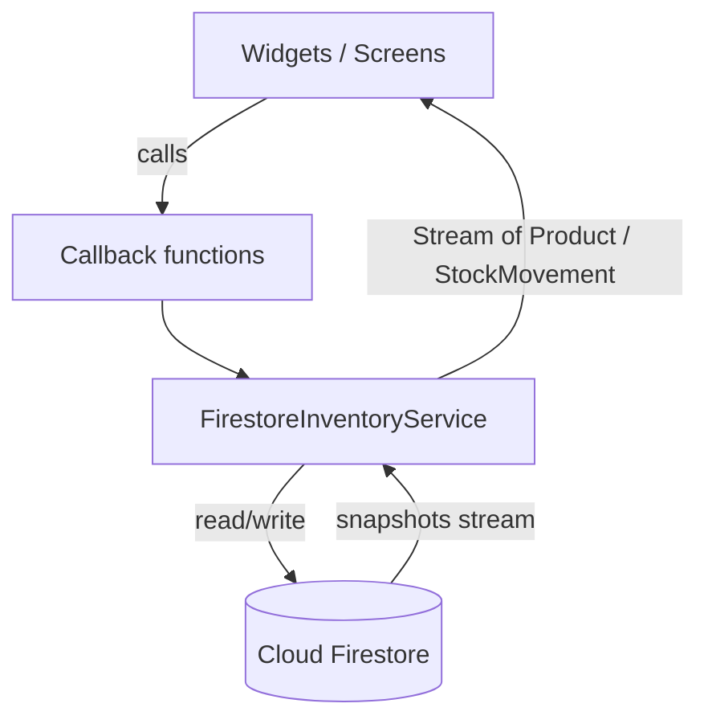
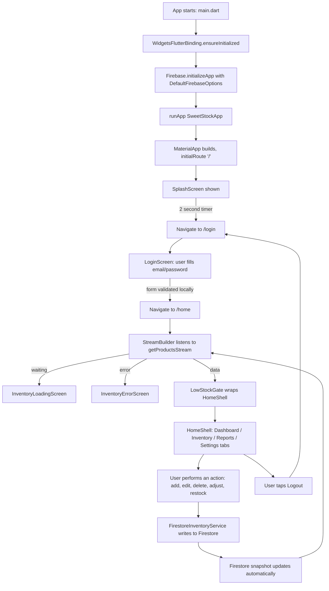

# 🍰 Pan de Batangueña — Bakery Inventory Management System

## Table of Contents

1. [Project Overview](#1-project-overview)
2. [Features](#2-features)
3. [Tech Stack](#3-tech-stack)
4. [Project Architecture](#4-project-architecture)
5. [Folder Structure](#5-folder-structure)
6. [System Requirements](#6-system-requirements)
7. [Installation Guide](#7-installation-guide)
8. [Firebase Configuration](#8-firebase-configuration)
9. [Environment Configuration](#9-environment-configuration)
10. [Dependencies](#10-dependencies)
11. [Running the Project](#11-running-the-project)
12. [How the System Works (Complete System Flow)](#12-how-the-system-works-complete-system-flow)
13. [User Roles](#13-user-roles)
14. [Database Structure](#14-database-structure)
15. [Authentication](#15-authentication)
16. [Screens Overview](#16-screens-overview)
17. [State Management](#17-state-management)
18. [Error Handling](#18-error-handling)
19. [Performance Considerations](#19-performance-considerations)
20. [Security](#20-security)
21. [Troubleshooting](#21-troubleshooting)
22. [Maintenance Guide](#22-maintenance-guide)
23. [Future Improvements](#23-future-improvements)
24. [Contributors](#24-contributors)
25. [License](#25-license)

---

## 1. Project Overview

**Pan de Batangueña** is a Flutter mobile/desktop/web application for managing the cake and pastry inventory of a bakery. It gives bakery staff a single, live view of stock levels, sales/restock activity, and simple reporting, backed by a Cloud Firestore database that updates in real time across every connected device.

The system solves a common small-business problem: keeping physical bakery inventory (cakes and pastries) synced with what's actually in the store, and knowing *before* an item runs out rather than after. Every quantity change — a manual +/- tap, a full restock, an edit, or a deletion — is written to Firestore immediately and reflected live on every screen via `StreamBuilder`, with a low-stock threshold that automatically prompts staff to restock when an item dips below its minimum.

It is intended for use by bakery staff and managers who need to track cakes and pastries, monitor stock health (In Stock / Low Stock / Out of Stock), and review basic weekly activity and inventory-value reports — without needing a point-of-sale system or a dedicated inventory specialist.

The project was developed as a self-contained Flutter + Firebase demo/capstone-style application, showcasing forms, navigation, gestures, live Firestore streams, and CRUD operations in a single cohesive bakery inventory experience.

---

## 2. Features

Only features that exist in the current codebase are listed below.

### 🔐 Login
- Email/password form with client-side validation (non-empty fields)
- Show/Hide password toggle
- Navigates to the home shell on successful form validation
- **Not detected in the current project:** real Firebase Authentication call, account creation, password reset, or session persistence (see [Section 15](#15-authentication))

### 🏠 Dashboard
- Four live statistic cards: Total Cakes, Total Pastries, Low Stock count, Out of Stock count — all computed from the live product list, never hardcoded
- Double-tap any stat card to open a bottom sheet listing the matching products
- "Recent Activity" feed driven by a live Firestore stream of the last 6 stock movements

### 📦 Inventory
- Live searchable/filterable product list (search by name/category; filter chips: All, Cakes, Pastries, Low Stock, Out of Stock)
- Inline quantity stepper (+/-) directly on each product card, without opening product details
- Add Product (floating action button)
- Edit Product
- Delete Product with confirmation dialog
- Automatic status badges (In Stock / Low Stock / Out of Stock) derived from quantity vs. minimum stock
- Restock dialog with quantity validation (must be greater than zero)
- Automatic **Low Stock Alert** dialog that appears the moment any product crosses into "Low Stock," with a one-tap path into the restock flow

### 📊 Reports
- Total Inventory, Inventory Value, Low Stock Items, Out of Stock summary cards
- Category Distribution donut chart (Cakes / Pastries / Other)
- Weekly Stock Movement bar chart (Mon–Sun), built from live `stock_movements` Firestore data grouped by weekday for the current calendar week
- **Weekly Summary** sub-page: totals for products added, sold, restocked, and overall stock movement for the current week, plus current inventory value and stock-health counts
- **Low Stock Alert Report** sub-page: a live, sorted list of every Low Stock / Out of Stock product

### 🧾 Product Details
- Full product detail view (name, ID, category, quantity, minimum stock, price, supplier, expiration date, status)
- Add Stock / Reduce Stock (±1) buttons
- Restock button
- Edit and Delete actions
- Local, in-session stock history log for the current viewing session

### ⚙️ Settings
- Dark Mode toggle
- Notifications toggle (drives the dashboard notification-dot indicator)
- Accent color picker (4 preset colors, drives the app's Material 3 color scheme)
- Links to Bakery Information and About
- Logout (returns to the login screen)

### Not present in this project
- Point of Sale (POS)
- Orders module
- Production module
- Demand forecasting
- Multi-user roles / permissions
- Push notifications (Cloud Messaging)
- File/image storage (Cloud Storage)
- Analytics

---

## 3. Tech Stack

| Layer | Technology |
|---|---|
| Frontend Framework | Flutter |
| Language | Dart |
| Backend | Firebase (Cloud Firestore + Firebase Core) |
| State Management | Native Flutter `StatefulWidget` + `setState()` — no external state management package is used |
| Database | Cloud Firestore |
| Authentication | **Not detected in the current project** — the Login screen only performs local form validation; no `firebase_auth` package is imported or used |
| Storage | **Not detected in the current project** — no `firebase_storage` usage found |
| Cloud Functions | **Not detected in the current project** |
| Analytics / Messaging | **Not detected in the current project** — although `firebase_options.dart` includes a `measurementId` (default FlutterFire scaffolding), no `firebase_analytics` or `firebase_messaging` package is imported or used in code |
| Firebase Packages Used | `firebase_core`, `cloud_firestore` |
| Other Key Packages | `flutter` (SDK) — no third-party UI, networking, or utility packages are imported anywhere in the codebase |

> **Note:** No `pubspec.yaml` was available at the time this README was generated, so exact package **version numbers** could not be confirmed. Package **names** above were determined directly from `import` statements in the source files. See [Section 10](#10-dependencies).

---

## 4. Project Architecture

The app follows a simple, flat, single-layer Flutter architecture — there is no Clean Architecture, MVVM, or Repository-pattern layering. Structure is:

- **UI Layer** — `StatelessWidget` / `StatefulWidget` screens and widgets (e.g. `DashboardPage`, `InventoryPage`, `ProductDetailsScreen`)
- **State** — held locally in `StatefulWidget` state (`setState`), and at the app root in `SweetStockApp`'s `_SweetStockAppState`, which owns theme mode, accent color, notifications flag, and the selected bottom-nav tab index
- **Business logic / callbacks** — CRUD operations are exposed as callback functions (e.g. `onUpdateProduct`, `onDeleteProduct`, `onAdjustStock`) that are threaded down through constructor parameters from `SweetStockApp` → `HomeShell` → each tab page → each row/dialog
- **Firebase Service Layer** — `FirestoreInventoryService` is the single point of contact with Firestore; no widget talks to Firestore directly
- **Models** — plain Dart classes (`Product`, `StockMovement`) with `fromFirestore()` / `toFirestore()` mapping methods
- **Navigation** — Flutter's built-in named-route `Navigator` via `MaterialApp.routes`, plus `MaterialPageRoute` for a few screens (Edit Product, Weekly Summary, Low Stock Report) that aren't part of the named route table
- **Data Flow** — one-directional: Firestore → `StreamBuilder` → UI. All writes go back through `FirestoreInventoryService`, which also logs a `stock_movements` document for every change, so read-side reports and the "Recent Activity" feed update automatically



---

## 5. Folder Structure

The project intentionally keeps everything as flat Dart files inside `lib/` — there are **no** `screens/`, `widgets/`, `models/`, or `services/` subfolders. Every file lives directly under `lib/`.

```
lib/
├── main.dart                        # App entrypoint: initializes Firebase, runs SweetStockApp
├── app.dart                         # SweetStockApp (MaterialApp + routes), LowStockGate, loading/error screens
├── constants.dart                   # App-wide color palette and app name constants
├── firebase_options.dart            # FlutterFire-generated platform Firebase configuration
├── product.dart                     # Product model + ProductDetailsArguments (route argument holder)
├── stock_movement.dart              # StockMovement model (drives Recent Activity + Weekly report)
├── firestore_inventory_service.dart # Single source of truth for all Firestore reads/writes
├── splash.dart                      # SplashScreen (2s timer → /login)
├── login.dart                       # LoginScreen (local form validation only)
├── home_shell.dart                  # HomeShell: bottom nav + drawer wrapping the 4 tabs
├── dashboard.dart                   # Dashboard tab: stat cards, recent activity, product tiles
├── inventory.dart                   # Inventory tab: search/filter list, stepper, dialogs (delete/restock/success/low-stock)
├── reports.dart                     # Reports tab: report cards, donut chart, bar chart, Weekly Summary & Low Stock Report pages
├── settings.dart                    # Settings tab, Bakery Information page, About page
├── add_product.dart                 # AddProductScreen (form)
├── edit_product.dart                # EditProductScreen (form)
└── product_details.dart             # ProductDetailsScreen (detail view + stock actions)
```

**Not detected in the current project:** an `assets/` folder, a `test/` folder, or any `android/`, `ios/`, `web/`, `windows/`, `macos/`, `linux/` platform folders were not part of the files reviewed for this README. A standard `flutter create` project will already contain these; they are omitted here only because they weren't supplied for analysis.

---

## 6. System Requirements

| Requirement | Notes |
|---|---|
| Operating System | Windows, macOS, or Linux (development machine) |
| Flutter SDK | **Not detected in the current project** — no `pubspec.yaml`/`environment:` constraint was available. Use a recent stable Flutter release. |
| Dart SDK | Bundled with Flutter SDK |
| Android Studio | Required for Android builds/emulators |
| VS Code (or any Flutter-supported IDE) | Optional but recommended |
| Firebase CLI | Required to run `flutterfire configure` |
| Git | Required to clone/manage the repository |
| Internet connection | Required — the app is fully dependent on live Cloud Firestore connectivity; there is no offline/local persistence mode configured in code |

---

## 7. Installation Guide

```bash
# 1. Clone the repository
git clone <your-repository-url>
cd <project-folder>

# 2. Confirm Flutter is installed and healthy
flutter doctor

# 3. Install project dependencies
flutter pub get

# 4. Log in to Firebase CLI (if not already)
firebase login

# 5. Connect the project to a Firebase project (see Section 8)
dart pub global activate flutterfire_cli
flutterfire configure

# 6. Run the app
flutter run
```

Platform-specific notes:

- **Android:** Ensure an emulator is running or a device is connected (`flutter devices`).
- **Web:** Run with `flutter run -d chrome`.
- **Desktop (Windows/macOS/Linux):** Desktop support must be enabled in your Flutter SDK (`flutter config --enable-<platform>-desktop`) — whether this project has desktop platform folders configured could not be confirmed from the files reviewed.
- **iOS:** Requires Xcode and a `GoogleService-Info.plist` (see Section 8) — could not confirm iOS platform folder presence from the files reviewed.

---

## 8. Firebase Configuration

This project uses **Cloud Firestore** and **Firebase Core** (via FlutterFire). To connect the project to your **own** Firebase project:

1. **Create a Firebase project** at [console.firebase.google.com](https://console.firebase.google.com).
2. **Enable Cloud Firestore** (Build → Firestore Database → Create database). Start in test mode for local development, then apply proper [Security Rules](#20-security) before any production use.
3. **Authentication is not currently wired into this app** — enabling it in the Firebase console alone will not activate login, since no `firebase_auth` code exists yet. See [Section 15](#15-authentication) if you plan to add it.
4. **Storage** — not used by this project; skip unless you plan to add image uploads yourself.
5. **Analytics / Cloud Messaging** — not used by this project; skip unless you plan to add them.
6. **Generate configuration files** using the FlutterFire CLI:
   ```bash
   flutterfire configure
   ```
   This will regenerate `lib/firebase_options.dart` for your own Firebase project and, depending on selected platforms, produce:
   - `android/app/google-services.json`
   - `ios/Runner/GoogleService-Info.plist`
7. Firestore will need two collections created automatically on first write: `products` and `stock_movements` (see [Section 14](#14-database-structure)) — no manual collection creation is required, Firestore creates them on first document write.

> ⚠️ Do not commit your own `google-services.json`, `GoogleService-Info.plist`, or a `firebase_options.dart` containing production keys to a public repository if you have applied restrictive Firestore Security Rules tied to a paid/production project. Firebase web API keys are not inherently secret, but access control should always be enforced via Firestore Security Rules, not by hiding the key.

---

## 9. Environment Configuration

- **Firebase Keys:** stored in `lib/firebase_options.dart`, generated by the FlutterFire CLI. This file is imported directly by `main.dart`.
- **API Keys:** no other third-party API keys are used anywhere in the reviewed source.
- **Environment variables / `.env` files:** **Not detected in the current project.** No `flutter_dotenv`, `--dart-define`, or similar mechanism is used — all configuration is compiled directly via `firebase_options.dart`.
- **What should be committed:** application source code, `pubspec.yaml`, `pubspec.lock`.
- **What should NOT be committed (recommended, not currently enforced by a `.gitignore` in the reviewed files):**
  - Platform build artifacts (`/build`, `/.dart_tool`)
  - Local IDE settings
  - Any personal/production Firebase config you don't intend to share publicly, if your Firestore rules are locked down to that project

---

## 10. Dependencies

Since no `pubspec.yaml` was provided, the table below lists only the packages actually **imported** in source code. Versions are marked as not detected — check your own `pubspec.yaml` for the resolved versions in your environment.

| Package | Purpose | Version | Why it's used |
|---|---|---|---|
| `flutter` (SDK) | Core UI framework | Not detected | Builds all screens, widgets, navigation, theming |
| `firebase_core` | Firebase app initialization | Not detected | `Firebase.initializeApp()` in `main.dart`; provides `FirebaseOptions` type used in `firebase_options.dart` |
| `cloud_firestore` | Firestore client | Not detected | All reads/writes in `FirestoreInventoryService`, plus `Timestamp`/`DocumentSnapshot`/`FieldValue` usage in `product.dart` and `stock_movement.dart` |

No other packages (state management, HTTP, image handling, local storage, etc.) are imported anywhere in the reviewed files.

---

## 11. Running the Project

| Command | What it does |
|---|---|
| `flutter pub get` | Downloads and links all dependencies listed in `pubspec.yaml` |
| `flutter run` | Builds and launches the app on a connected device/emulator/browser in debug mode with hot reload |
| `flutter build apk` | Produces a release Android APK (`build/app/outputs/flutter-apk/`) |
| `flutter build web` | Produces a release web build (`build/web/`) |
| `flutter build windows` | Produces a release Windows desktop build (requires Windows desktop support enabled) |
| `flutter clean` | Removes build artifacts (`build/`, `.dart_tool/`) — use when builds behave unexpectedly |
| `flutter pub upgrade` | Upgrades dependencies to the latest versions allowed by `pubspec.yaml` constraints |

---

## 12. How the System Works (Complete System Flow)



### Authentication flow
The `LoginScreen` validates that email and password fields are non-empty, then calls `Navigator.pushReplacementNamed('/home')`. **No credentials are verified against Firebase or any backend** — this is a UI-only gate. See [Section 15](#15-authentication) for details.

### Navigation flow
Flutter's built-in `Navigator` handles all screen transitions using named routes defined in `MaterialApp.routes` (`/`, `/login`, `/home`, `/add-product`, `/product-details`, `/bakery-info`, `/about`). A few screens not needed at app-startup (Edit Product, Weekly Summary, Low Stock Report) are pushed via `MaterialPageRoute` instead of being registered as named routes.

### Data flow
`FirestoreInventoryService.getProductsStream()` and `getMovementsStream()` return live Firestore `Stream`s. `StreamBuilder` widgets throughout the app (Home route, Dashboard, Reports) rebuild automatically whenever Firestore emits a new snapshot — there is no manual refresh/pull-to-refresh mechanism, and none is needed.

### Firestore read/write process
Every write (add, update, delete, restock, quantity adjust) goes through `FirestoreInventoryService`, which:
1. Performs the actual `products` collection write (`add`, `update`, or `delete`).
2. Immediately writes a corresponding document to the `stock_movements` collection describing what changed.

This means Recent Activity and the Weekly Stock Movement chart are always a direct reflection of real writes — nothing is faked or estimated client-side.

### State updates
Local UI state (search text, selected filter chip, form field values, dialog error text) is held with `setState()` inside each `StatefulWidget`. App-wide state (theme mode, accent color, notifications toggle, selected bottom-nav index) lives in `_SweetStockAppState` at the root and is passed down as constructor parameters and callbacks.

### User interaction flow
Tapping a product opens `ProductDetailsScreen`. Tapping the inline +/- stepper on an Inventory row adjusts quantity directly without opening details. Double-tapping a Dashboard stat card opens a bottom sheet of matching products. All destructive actions (delete) go through a confirmation `AlertDialog` first.

### Error handling
The `/home` route's `StreamBuilder` explicitly handles the `ConnectionState.waiting` state (shows `InventoryLoadingScreen`) and the `snapshot.hasError` state (shows `InventoryErrorScreen` with the raw error message). Form fields use standard Flutter `Form`/`TextFormField` `validator` callbacks.

### Loading states
`InventoryLoadingScreen` (full-screen spinner) is shown while the initial products stream connects. Individual save/submit buttons (Add Product, Edit Product) show an inline circular spinner (`_isSaving` flag) while awaiting the Firestore write to complete.

---

## 13. User Roles

**Not detected in the current project.** There is no role field on any model, no role-based navigation branching, and no Firestore rule enforcement reviewed as part of this codebase. Every logged-in user sees the exact same Dashboard, Inventory, Reports, and Settings tabs with full CRUD access to all products.

---

## 14. Database Structure

Two Firestore collections are used, both at the root level (no subcollections observed in code).

### `products`

| Field | Type | Notes |
|---|---|---|
| `name` | string | |
| `category` | string | `'Cakes'` or `'Pastries'` |
| `quantity` | number | current stock count |
| `minimumStock` | number | **Firestore field name differs from the Dart property name** (`minStock`) — this mapping is intentional, documented directly in `product.dart` |
| `price` | number | unit price (₱) |
| `supplier` | string | |
| `dateAdded` | timestamp | |
| `expirationDate` | timestamp \| null | optional |

`status` (`In Stock` / `Low Stock` / `Out of Stock`) is **never stored** — it's always derived client-side from `quantity` vs `minimumStock`.

Example document:
```json
{
  "name": "Chocolate Cake",
  "category": "Cakes",
  "quantity": 5,
  "minimumStock": 1,
  "price": 550,
  "supplier": "Pande Batanguena",
  "dateAdded": "2026-07-17T19:36:52+08:00",
  "expirationDate": "2026-07-24T08:00:00+08:00"
}
```

### `stock_movements`

| Field | Type | Notes |
|---|---|---|
| `productId` | string | |
| `productName` | string | |
| `action` | string | one of: `added`, `updated`, `deleted`, `increased`, `decreased`, `restock`, `low_stock`, `out_of_stock` |
| `quantityChange` | number | signed delta |
| `previousQuantity` | number | |
| `newQuantity` | number | |
| `timestamp` | timestamp | set via `FieldValue.serverTimestamp()` |

Example document:
```json
{
  "productId": "R6kAZBRhxZhSKCWhwvHO",
  "productName": "Red Velvet Muffin",
  "action": "decreased",
  "quantityChange": -1,
  "previousQuantity": 39,
  "newQuantity": 38,
  "timestamp": "2026-07-17T23:30:02+08:00"
}
```

**Relationships:** `stock_movements.productId` is a loose reference to a `products` document ID — there is no Firestore-level foreign key or join; the app queries each collection independently and matches by ID only when needed for display.

**Indexes:** **Not detected in the current project.** Both queries used (`orderBy('dateAdded', descending: true)` and `orderBy('timestamp', descending: true)`) are single-field ordered queries, which Firestore indexes automatically by default — no composite indexes are required by the current query patterns.

---

## 15. Authentication

**Important:** this project does **not** currently implement real authentication.

- **Login:** `LoginScreen` validates that the email and password fields are non-empty (via `Form`/`TextFormField` validators) and then simply navigates to `/home`. No `firebase_auth` package is imported, and no credentials are checked against any backend.
- **Logout:** Available from the Settings tab and the navigation drawer; it calls `Navigator.pushNamedAndRemoveUntil('/login', ...)`, which only changes the visible screen — it does not sign out of any backend, because nothing was signed into.
- **Session management / persistent login:** **Not detected in the current project.** There is no session, token, or persisted login state — reopening the app always starts at the splash screen and requires going through the login form again.
- **Role checking / authorization:** **Not detected in the current project** (see [Section 13](#13-user-roles)).
- **Password reset:** A "Forgot Password?" link exists in the UI but has an empty `onPressed: () {}` handler — it is not implemented.

If you intend to secure this application for real use, integrating `firebase_auth` (and enforcing matching Firestore Security Rules) should be treated as a required next step, not an optional enhancement.

---

## 16. Screens Overview

| Screen | Purpose | Main Widgets | Firebase Interaction | Navigation |
|---|---|---|---|---|
| `SplashScreen` | Branding splash, 2s auto-advance | `Container`, `LinearProgressIndicator` | None | → `/login` |
| `LoginScreen` | Local-only login form | `Form`, `TextFormField` | None | → `/home` |
| `HomeShell` | Bottom-nav + drawer shell hosting the 4 tabs | `Scaffold`, `BottomNavigationBar`, `Drawer`, `IndexedStack` | None directly (delegates to child tabs) | → Add Product, Bakery Info, About, Logout |
| `DashboardPage` | Stat overview + recent activity | `GridView`, stat cards, `StreamBuilder` | Reads `stock_movements` stream | Double-tap → bottom sheet |
| `InventoryPage` | Searchable/filterable product list | `TextField`, `ChoiceChip`, `ListView.builder` | Writes via callbacks (adjust/restock/update/delete) | → Product Details, → Edit Product |
| `ReportsPage` | Report cards, donut & bar charts | `CustomPaint`, `StreamBuilder` | Reads `stock_movements` stream | → Weekly Summary, → Low Stock Report |
| `WeeklySummaryPage` | Weekly totals | `ListView` | Reads `stock_movements` stream | Back |
| `LowStockReportPage` | Live low/out-of-stock list | `StreamBuilder`, `ListView.separated` | Reads `products` stream | Back |
| `SettingsPage` | Theme, notifications, accent color | `SwitchListTile`, color pickers | None | → Bakery Info, About, Logout |
| `BakeryInfoPage` | Static bakery details | `Card`, `_DetailRow` | None | Back |
| `AboutPage` | App info | `Card` | None | Back |
| `AddProductScreen` | Create a new product | `Form`, `TextFormField`, `DropdownButtonFormField` | Writes to `products` + `stock_movements` (via callback) | Back on save |
| `EditProductScreen` | Edit an existing product | `Form`, `TextFormField` | Writes to `products` + `stock_movements` (via callback) | Back on save |
| `ProductDetailsScreen` | Full detail view + stock actions | `Card`, `_DetailRow`, action buttons | Writes via callbacks (adjust/restock/update/delete) | → Edit Product |

---

## 17. State Management

The project uses **plain Flutter state management** — `StatefulWidget` + `setState()`. No Provider, Riverpod, Bloc, or GetX package is imported or used anywhere in the reviewed source.

- **App-root state** (`_SweetStockAppState` in `app.dart`): theme mode, accent color, notifications toggle, selected bottom-nav tab index, and all CRUD methods that call into `FirestoreInventoryService`.
- **Screen-local state**: search text and filter selection in `InventoryPage`, form field controllers in `AddProductScreen`/`EditProductScreen`, dialog validation errors in `showRestockDialog`, in-session stock history in `ProductDetailsScreen`.
- **Data flows down** via constructor parameters (including function-typed callback parameters like `onUpdateProduct`), and **events flow up** by invoking those callbacks, which ultimately call `FirestoreInventoryService`, whose Firestore writes trigger new stream snapshots that flow back down through `StreamBuilder`.

---

## 18. Error Handling

- **Firebase/network errors:** the `/home` route's `StreamBuilder` checks `snapshot.hasError` and renders `InventoryErrorScreen` with the raw error message.
- **Authentication errors:** not applicable — there is no authentication backend to error against (see [Section 15](#15-authentication)).
- **Validation:** all forms (Login, Add Product, Edit Product, Restock dialog) use `Form`/`TextFormField`/`validator` (or manual `setState` error text for the restock dialog) to block submission of invalid input (empty fields, negative quantities, non-positive prices, non-numeric restock quantity).
- **Exceptions:** no custom exception types or `try/catch` blocks were found around Firestore calls in the reviewed source — Firestore write failures would surface as unhandled `Future` errors unless caught by the Flutter framework's default error reporting.
- **Loading indicators:** `CircularProgressIndicator` is used in `InventoryLoadingScreen`, inside Dashboard/Reports `StreamBuilder`s while waiting for the first snapshot, and inline in Save/Update buttons while a write is in flight.
- **Snackbars:** used to confirm successful restocks (`ScaffoldMessenger.showSnackBar`).
- **Dialogs:** `AlertDialog` is used for delete confirmation, low-stock warnings, the automatic Low Stock Alert, the restock quantity dialog, and the generic success dialog.

---

## 19. Performance Considerations

Based on what's actually implemented:

- **Live streaming, not polling:** all data comes from Firestore `Stream`s, so the UI updates only when data actually changes — no manual polling loops exist.
- **Query scope:** `getProductsStream()` and `getMovementsStream()` each fetch and stream the **entire** collection (ordered, but unfiltered/unpaginated). There is no pagination, `limit()`, or query-level filtering by category/status — filtering for the Inventory search/filter chips happens **client-side** on the already-fetched list. This is a reasonable approach for small-to-medium bakery catalogs but would need revisiting (e.g. `limit()`, Firestore-side `where()` filters, pagination) at larger scale.
- **Recent Activity** intentionally caps its display to the 6 most recent movements client-side (`movements.take(6)`), though the underlying stream still delivers the full collection.
- **Widget rebuilding:** `IndexedStack` is used in `HomeShell` to keep all 4 tabs alive rather than rebuilding them on every tab switch, at the cost of keeping all four pages resident in memory simultaneously.
- **Image optimization / caching:** **Not detected in the current project** — no `Image` widgets loading remote/asset images were found; icons are drawn from Flutter's built-in `Icons` set only.
- **Memory usage:** no explicit memory-management concerns were identified in the reviewed code beyond standard `TextEditingController.dispose()` calls, which are present in every form screen.

---

## 20. Security

- **Firebase Security Rules:** **Not detected in the current project** — no `firestore.rules` file was included in the reviewed files. Without explicit rules, a newly created Firestore database defaults to either fully locked or fully open depending on the mode chosen at creation ("production mode" vs "test mode"), and this must be configured deliberately before any real deployment.
- **Authentication:** not implemented (see [Section 15](#15-authentication)) — as a direct consequence, **no Firestore rule can currently distinguish between users**, since there is no signed-in user/UID for rules to check against.
- **Storage Rules:** not applicable — Cloud Storage is not used.
- **Input validation:** enforced client-side only, via Flutter form validators (see [Section 18](#18-error-handling)). There is no server-side (Cloud Functions) validation layer.
- **Permissions:** every user of the app currently has unrestricted read/write access to both collections, since there is no auth-gated access control implemented.

**Recommendation:** before any production or public deployment, implement Firebase Authentication and corresponding Firestore Security Rules that require `request.auth != null` (at minimum) on all `products` and `stock_movements` reads/writes.

---

## 21. Troubleshooting

| Issue | Likely Cause / Fix |
|---|---|
| `flutter doctor` shows errors | Follow the specific guidance printed by the command (missing Android SDK, missing Xcode, etc.) — resolve each flagged item individually |
| Gradle build fails on Android | Run `flutter clean`, then `flutter pub get`, then rebuild. Confirm your Android Gradle Plugin/Gradle versions are compatible with your installed Flutter/Android Studio versions |
| `Firebase.initializeApp()` throws / hangs | Confirm `WidgetsFlutterBinding.ensureInitialized()` is called **before** `Firebase.initializeApp()` in `main.dart` (it already is in this project) — this is the most common cause when copying this pattern elsewhere |
| `google-services.json` missing (Android) | Run `flutterfire configure` again, or manually download it from Firebase Console → Project Settings → Your Android app, and place it in `android/app/` |
| "Firebase connection failed" / Firestore calls hang forever | Check internet connectivity, check that Firestore is enabled in the Firebase Console, and confirm `lib/firebase_options.dart` matches an active Firebase project |
| `flutter pub get` errors | Delete `pubspec.lock` and `.dart_tool/`, then retry. Confirm your Flutter SDK version satisfies the constraints in `pubspec.yaml` |
| Build failed with obscure Dart errors after manually splitting files | Check for missing `import` statements between the split files (`constants.dart`, `product.dart`, etc.) — a common issue when files reference classes/constants defined elsewhere |
| Android emulator won't start | Open Android Studio → Device Manager → cold boot or recreate the AVD |
| Package/dependency conflicts | Run `flutter pub deps` to inspect the dependency graph; consider `flutter pub upgrade --major-versions` cautiously |
| "Permission denied" from Firestore | Check your Firestore Security Rules — since this project has no authentication, rules that require `request.auth != null` will reject **all** requests until auth is implemented |
| Login screen "accepts" any input | This is expected current behavior — see [Section 15](#15-authentication); it is not a bug, it is a missing feature |
| Hot reload doesn't reflect Firestore data changes | Hot reload only reloads code, not stream state — this is normal Flutter/StreamBuilder behavior. Data itself updates live via the stream regardless of hot reload |

---

## 22. Maintenance Guide

- **Adding a new screen:** create a new flat `.dart` file in `lib/` (matching the project's existing no-subfolder convention), then register it either as a named route in `app.dart`'s `MaterialApp.routes` map, or push it via `MaterialPageRoute` from wherever it's launched — following the existing pattern used by `WeeklySummaryPage` and `LowStockReportPage`.
- **Adding a new Firestore collection:** add a `CollectionReference` getter to `FirestoreInventoryService` (matching the pattern of `_productsRef`/`_movementsRef`), and add corresponding read/write methods there — never call Firestore directly from a widget.
- **Adding a new model:** create a new file (e.g. `my_model.dart`) with a plain Dart class exposing `fromFirestore()`/`toFirestore()` factory/method pairs, matching `Product` and `StockMovement`.
- **Adding a new service:** keep the "one service per Firestore concern" pattern already established, and keep services free of any Flutter/UI imports.
- **Updating packages:** run `flutter pub outdated` to review, then `flutter pub upgrade` (or bump versions manually in `pubspec.yaml` for major upgrades), followed by a full regression pass through Login → Dashboard → Inventory → Reports → Settings.
- **Deploying changes:** use the standard `flutter build <platform>` commands (Section 11); there is no CI/CD configuration in the reviewed files.
- **Code quality:** the project currently has no linter configuration (`analysis_options.yaml`) in the reviewed files — adding one and running `flutter analyze` before merging changes is recommended.

---

## 23. Future Improvements

Realistic next steps based on what currently exists (not invented feature ideas):

- Implement real Firebase Authentication and remove the current "any non-empty input logs you in" behavior
- Add Firestore Security Rules gated on authenticated users (and roles, if multi-user access is needed)
- Add pagination/`limit()` and server-side filtering to `getProductsStream()`/`getMovementsStream()` as the catalog and activity history grow
- Persist login/session state so the app doesn't require re-login on every launch
- Implement the currently non-functional "Forgot Password?" link
- Add automated tests (none currently exist in the reviewed files)
- Add a `firestore.rules` file and an `analysis_options.yaml` linter configuration to the repository

---

## 24. Contributors

| Name | Role |
|---|---|
| _Mar Jhon Lowie Matalog_ | Project Owner / Developer |
| _John Cedrick Deriquito_ | Contributor |
| _Larz Byron Ingco_ | Contributor |

---

## 25. License

**Not detected in the current project** — no `LICENSE` file was included in the reviewed files.

If you intend to open-source this project, consider adding a standard license such as MIT:

```
MIT License

Copyright (c) [year] [copyright holder]

Permission is hereby granted, free of charge, to any person obtaining a copy
of this software and associated documentation files (the "Software"), to deal
in the Software without restriction, including without limitation the rights
to use, copy, modify, merge, publish, distribute, sublicense, and/or sell
copies of the Software...
```

Replace this placeholder with your actual chosen license before distributing the project.
